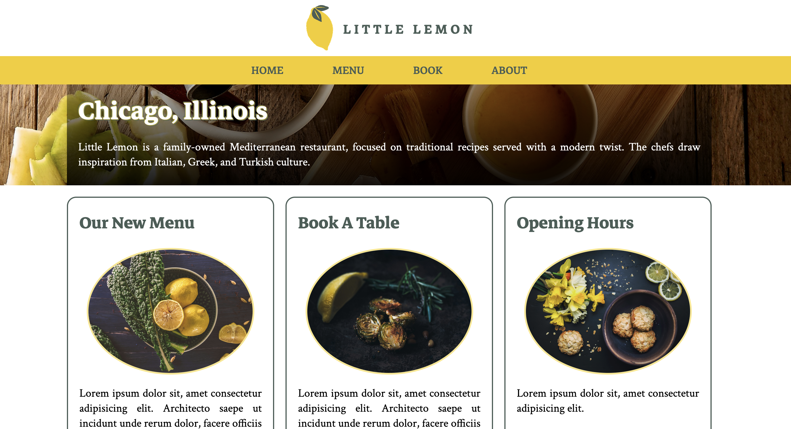

<h1>Little Lemon</h1>

<h2>Table of Contents</h2>

- [Overview](#overview)
  - [Key Features](#key-features)
- [Project Preview](#project-preview)
- [Project Structure](#project-structure)
- [Technologies Used](#technologies-used)
- [Contributing](#contributing)
- [Getting Started](#getting-started)
- [Acknowledgements](#acknowledgements)

## Overview

Restaurant: Little Lemon - project for the capstone project of the Meta front-end developer professional certificate.

This project showcases modern web design techniques, focusing on the implementation of CSS Grid and Flexbox layouts.

### Key Features

+ **CSS Grid Layout:** Demonstrates proficiency in creating complex, responsive layouts using CSS Grid.
+ **Flexbox:** Utilizes Flexbox for enhanced control over the alignment and distribution of elements within layouts.
+ **HTML Structure:** Implements semantic HTML5 markup to ensure accessibility and SEO best practices.

## Project Preview

Check out the live demo [here](https://alexjyad.github.io/Little-Lemon/).



## Project Structure

```plaintext
little-lemon/
├── index.html          # Homepage HTML file
├── styles.css          # Main stylesheet
├── img/                # Directory for project images
│   ├── logo/           # Directory for logos
│   └── main/           # Directory for main images
└── image.png           # image for README file
```

## Technologies Used
+ HTML: Semantic markup for content structure.
+ CSS: CSS Grid and Flexbox for layout and styling.
+ Git: Version control management

## Contributing

This project is for educational purposes and contributions are not expected.

## Getting Started

To view the project locally, follow these steps:

1. Clone the repository:

```bash
git clone https://github.com/AlexJYad/Little-Lemon.git
```
2. Navigate into the project directory:

```bash
cd Little-Lemon
```

3. Open index.html in your web browser to view the homepage:
   - You can do this by double-clicking index.html or right-clicking and choosing "Open with" your preferred browser.

## Acknowledgements

- [Coursera](https://www.coursera.org) for providing the opportunity to learn and grow.
- [Meta](https://www.coursera.org/learn/html-and-css-in-depth) for a great course on HTML and CSS in depth.
